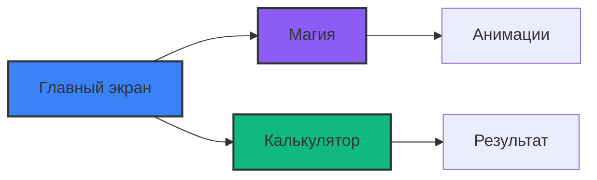

# ✨ Мой первый красивый сайт
<div align="center">
 
<p>
  
  
  
</p>

<p>
  
</p>


</div>

---

## 🎯 **О проекте**

<div align="center">
  
> **Современный, адаптивный и стильный сайт, созданный новичком в веб-разработке**

Этот проект — идеальная отправная точка для тех, кто хочет научиться создавать красивые сайты.  
Здесь собраны все современные техники: градиенты, анимации, адаптив и интерактивность на чистом JS.

</div>

---

## ✨ **Особенности**

<div align="center">
  
| 🎨 **Дизайн** | 🎮 **Интерактив** | 📱 **Адаптив** |
|--------------|-------------------|----------------|
| Градиентный фон | Магическая кнопка | Mobile-first |
| Стекломорфизм | Калькулятор | Гибкие сетки |
| Плавные анимации | Всплывающие тосты | Медиа-запросы |
| Кастомный скролл | Плавная прокрутка | Retina-ready |

</div>

---

### 💻 **Десктоп версия**

### 📱 **Мобильная версия**

<div align="center">
  
<table>
  <tr>
    <td align="center" width="33%">
      <br/>
      <span style="font-size: 32px;">📜</span>
      <br/>
      <b>Горизонтальный<br/>скролл</b>
      <br/>
      <sub>Плавная прокрутка</sub>
      <br/><br/>
    </td>
    <td align="center" width="33%">
      <br/>
      <span style="font-size: 32px;">🔘</span>
      <br/>
      <b>Увеличенные<br/>кнопки</b>
      <br/>
      <sub>Удобное нажатие</sub>
      <br/><br/>
    </td>
    <td align="center" width="33%">
      <br/>
      <span style="font-size: 32px;">🔤</span>
      <br/>
      <b>Оптимизированные<br/>шрифты</b>
      <br/>
      <sub>Читаемый текст</sub>
      <br/><br/>
    </td>
  </tr>
  <tr>
    <td align="center" width="33%">
      <br/>
      <span style="font-size: 32px;">👆</span>
      <br/>
      <b>Touch-friendly<br/>интерфейс</b>
      <br/>
      <sub>Полная поддержка</sub>
      <br/><br/>
    </td>
    <td align="center" width="33%">
      <br/>
      <span style="font-size: 32px;">⚡</span>
      <br/>
      <b>Плавные<br/>жесты</b>
      <br/>
      <sub>Натуральные движения</sub>
      <br/><br/>
    </td>
    <td align="center" width="33%">
      <br/>
      <span style="font-size: 32px;">🚀</span>
      <br/>
      <b>Мгновенный<br/>отклик</b>
      <br/>
      <sub>Быстрая реакция</sub>
      <br/><br/>
    </td>
  </tr>
</table>

</div>

## 📸 **Скриншоты**

<div align="center">
  


<br>
<em>✨ Главный экран с магической кнопкой (слева) и адаптивная мобильная версия (справа)</em>

</div>

## ✨ Особенности проекта

### 🎨 **Дизайн**
- Современный градиентный фон
- Эффект размытия (glassmorphism)
- Плавные анимации и переходы
- Кастомный скроллбар
- Адаптив под все устройства

### 🎮 **Интерактив**
- "Магическая" кнопка с меняющимся цветом и текстом
- Калькулятор с поддержкой 4 операций
- Всплывающие уведомления (toasts)
- Плавная прокрутка по якорям

### 📱 **Адаптивность**
- Mobile-first подход
- Гибкие сетки (Grid + Flexbox)
- Медиа-запросы для всех разрешений

## 🎨 **Визуальная карта технологий**

```mermaid
flowchart TD
    A[💎 МОЙ САЙТ] --> B[📄 HTML5]
    A --> C[🎨 CSS3]
    A --> D[⚡ JavaScript]
    
    B --> B1[🏗️ Семантика]
    B --> B2[🔍 SEO]
    B --> B3[♿ Доступность]
    
    C --> C1[📐 Flexbox/Grid]
    C --> C2[✨ Анимации]
    C --> C3[🎭 Градиенты]
    C --> C4[📱 Адаптив]
    
    D --> D1[🖱️ События]
    D --> D2[📦 DOM API]
    D --> D3[💬 Toasts]
    D --> D4[🎮 Интерактив]
    
    style A fill:#3B82F6,stroke:#fff,stroke-width:2px,color:#fff
    style B fill:#E34F26,stroke:#fff,stroke-width:2px,color:#fff
    style C fill:#1572B6,stroke:#fff,stroke-width:2px,color:#fff
    style D fill:#F7DF1E,stroke:#fff,stroke-width:2px,color:#000
    style B1 fill:#FF6B35,stroke:#fff,stroke-width:1px
    style B2 fill:#FF6B35,stroke:#fff,stroke-width:1px
    style B3 fill:#FF6B35,stroke:#fff,stroke-width:1px
    style C1 fill:#00A8E8,stroke:#fff,stroke-width:1px
    style C2 fill:#00A8E8,stroke:#fff,stroke-width:1px
    style C3 fill:#00A8E8,stroke:#fff,stroke-width:1px
    style C4 fill:#00A8E8,stroke:#fff,stroke-width:1px
    style D1 fill,#F7DF1E,stroke:#000,stroke-width:1px,color:#000
    style D2 fill,#F7DF1E,stroke:#000,stroke-width:1px,color:#000
    style D3 fill,#F7DF1E,stroke:#000,stroke-width:1px,color:#000
    style D4 fill,#F7DF1E,stroke:#000,stroke-width:1px,color:#000
```

<div align="center">



</div>
---

### 📋 **Таблица с описанием файлов**

<div align="center">

| 📄 Файл | 📝 Назначение | 🎯 Размер | 🔥 Важность |
|---------|--------------|-----------|-------------|
| **index.html** | 🏠 Основная структура страницы | ~5 KB | ⭐⭐⭐⭐⭐ |
| **style.css** | 💅 Все стили и анимации | ~8 KB | ⭐⭐⭐⭐⭐ |
| **script.js** | 🎮 Вся интерактивность | ~6 KB | ⭐⭐⭐⭐☆ |
| **README.md** | 📚 Документация проекта | ~6 KB | ⭐⭐⭐⭐☆ |
| **img/png** | 🌄 Изображение главного экрана | ~176 KB | ⭐⭐⭐☆☆ |

</div>

## 🚀 Как запустить

### Локальный запуск

1. **Склонируй репозиторий**
2. 
   ```bash
   git clone https://github.com/style-beep/site.git
   
3. Открой index.html в браузере

Просто дважды кликни по файлу

Или используй Live Server в VS Code

# Если у тебя установлен Python
python -m http.server 8000

# Или используй npx
npx serve .

 ```bash
 Что внутри
🔮 Магическая кнопка
javascript
// При каждом клике меняется:
// - Текст кнопки
// - Цвет фона
// - Появляется уведомление

🧮 Калькулятор
Сложение (+)

Вычитание (-)

Умножение (*)

Деление (/)

Защита от деления на ноль
```
📱 Адаптивные карточки
Автоматически подстраиваются под ширину экрана

Эффект при наведении

Плавное появление при загрузке

## 🎨 **Кастомизация**

### Изменение цветовой схемы

В файле `style.css` найди эти переменные:

```css
body {
    background: linear-gradient(145deg, #0B1120 0%, #111827 100%);
}

.btn-primary {
    background: #3B82F6;  /* Поменяй на свой цвет */
}
```

Добавление своих карточек
В index.html скопируй блок .card:
<div class="card">
    <div class="card-icon">🚀</div>
    <h3>Название навыка</h3>
    <p>Описание твоих навыков</p>
</div>

📱 Адаптивность
Устройство	Ширина экрана	Поведение
📱 Телефоны	< 768px	Вертикальное расположение, уменьшенные шрифты
📟 Планшеты	768px - 1024px	Оптимизированные отступы
💻 Десктопы	> 1024px	Полный функционал

✨ Эффекты
Эффект	Описание
🖱️ Наведение на карточку	Плавное поднятие и изменение цвета границы
🎬 Загрузка страницы	Плавное появление элементов с анимацией
🔮 Клик на магическую кнопку	Смена цвета и всплывающее уведомление
